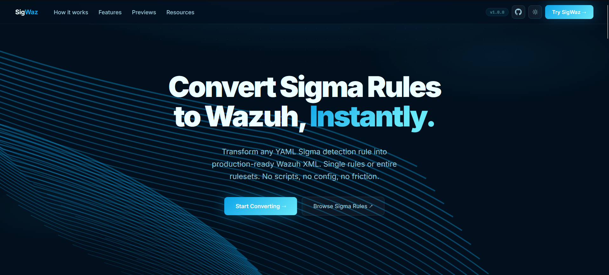
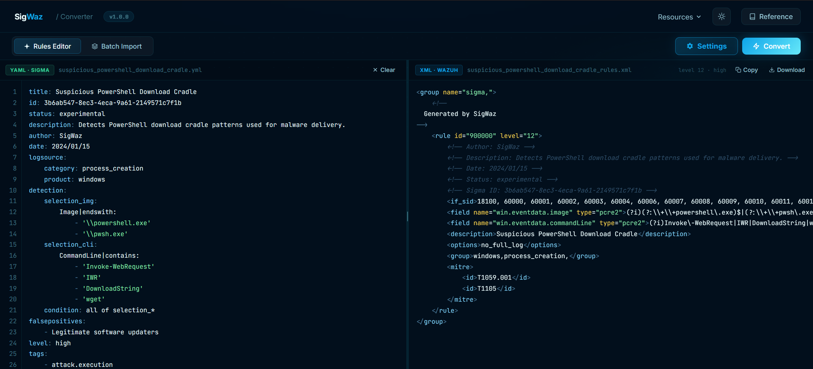

# SigWaz CLI

Convert [Sigma](https://github.com/SigmaHQ/sigma) detection rules to production-ready [Wazuh](https://wazuh.com) XML, from the command line.

SigWaz supports single-rule conversion, recursive batch directory processing, ZIP archives, and full metadata filtering, all scriptable with no interactive prompts.

---

## Example

**Input** : a standard Sigma rule (`rule.yml`):

```yaml
title: Suspicious PowerShell Download Cradle
status: stable
description: Detects PowerShell download cradle patterns used for payload delivery
author: SigWaz Example
date: 2024/01/15
logsource:
    category: process_creation
    product: windows
detection:
    selection:
        CommandLine|contains:
            - 'IEX (New-Object'
            - 'Invoke-Expression'
            - 'DownloadString('
    condition: selection
falsepositives:
    - Legitimate administrative scripts
level: high
tags:
    - attack.execution
    - attack.t1059.001
```

**Command:**

```bash
python sigwaz.py convert rule.yml
```

**Terminal output:**

```
╭──────────────────────────────────────────╮
│  SigWaz  v1.0.0                          │
│  Sigma → Wazuh  ·  State-of-the-art      │
╰──────────────────────────────────────────╯

  ✓  Suspicious PowerShell Download Cradle
  Sigma ID :  -
  Level    :  high
  Status   :  stable
  Wazuh IDs:  900001
  Rules    :  1 generated  (1.4 ms)
  MITRE    :  T1059.001

  ✓  XML validation passed  (1 rule, 0 warnings)
```

**Generated Wazuh XML** (`suspicious_powershell_download_cradle_rules.xml`):

```xml
<!-- Author: SigWaz Example -->
<!-- Description: Detects PowerShell download cradle patterns used for payload delivery -->
<!-- Date: 2024/01/15 | Status: stable -->
<!-- References: https://github.com/SigmaHQ/sigma/tree/master/rules -->
<group name="sigma,">

  <rule id="900001" level="12">
    <if_sid>61603</if_sid>
    <field name="win.eventdata.commandLine" type="pcre2">(?i)IEX \(New\-Object|Invoke\-Expression|DownloadString\(</field>
    <description>Suspicious PowerShell Download Cradle</description>
    <options>no_full_log</options>
    <group>windows,process_creation,</group>
    <mitre>
      <id>T1059.001</id>
    </mitre>
  </rule>

</group>
```

Drop it into `/var/ossec/etc/rules/` on your Wazuh manager and reload, done.

---

## Features

- **Single & batch conversion** : one file, a directory tree, a multi-doc YAML, or a ZIP archive
- **Recursive directory scanning** : walks subdirectories automatically, skips `deprecated/` folders
- **Advanced metadata filtering** : filter by status (`experimental`, `deprecated`…), minimum severity level, or allowed products
- **XML splitting** : automatically split large outputs into chunks to prevent Wazuh OOM on import
- **Stable rule IDs** : optional ID tracker persists Sigma GUID → Wazuh ID mappings across re-runs
- **Config file support** : store all parameters in a YAML or JSON profile; CLI flags override when needed
- **ZIP output** : bundle all split XML files into a single `.zip` for easy deployment
- **XML validation** : built-in structural validation after every conversion
- **Field mapping tables** : inspect all Sigma → Wazuh decoder path mappings
- **No TUI, fully scriptable** : designed for automation and CI pipelines

---

## Prerequisites

- Python 3.11 or later
- pip

---

## Installation

```bash
git clone https://github.com/heraclescap/sigwaz-cli.git
cd sigwaz-cli
pip install -r requirements.txt
```

Verify:

```bash
python sigwaz.py --help
```

Or, if installed as a package:

```bash
pip install -e .
sigwaz --help
```

---

## Usage

### Convert a single rule

```bash
# Print XML to stdout
python sigwaz.py convert rule.yml

# Save to a file
python sigwaz.py convert rule.yml -o output/rule_rules.xml

# Dry-run (analyse without writing)
python sigwaz.py convert rule.yml --dry-run

# Custom rule ID base; also include experimental rules (stable is always included)
python sigwaz.py convert rule.yml -r 910000 -I experimental
```

### Batch-convert a directory

```bash
# Recursive scan of a directory, output to output/
python sigwaz.py batch rules/windows/ -o output/

# Split into chunks of 100 rules max
python sigwaz.py batch rules/ -o output/ --split 100

# Filter: medium+ severity, stable rules only (default) : nothing extra to add
python sigwaz.py batch rules/ -o output/ --min-level medium

# Also include experimental and test rules on top of stable
python sigwaz.py batch rules/ -o output/ -I experimental,test

# Only Windows and Linux rules
python sigwaz.py batch rules/ -o output/ --allowed-products windows,linux

# Bundle output into a ZIP archive
python sigwaz.py batch rules/ -o output/ --zip

# From a ZIP archive of YAML files
python sigwaz.py batch sigma-rules.zip -o output/ --split 50
```

### Using a config file

For complex setups, store all parameters in a config file to avoid long command lines:

```bash
python sigwaz.py batch rules/ -o output/ --config config.yaml
```

CLI flags always override the config file when explicitly provided:

```bash
# Uses config.yaml but forces min-level to high
python sigwaz.py batch rules/ -o output/ --config config.yaml --min-level high
```

#### Example `config.yaml`

```yaml
rule_id_start: 900000
no_full_log: true
email_alert: false
email_levels:
  - critical
  - high
excluded_statuses:
  - experimental
  - deprecated
min_level: medium
allowed_products:
  - windows
  - linux
  - aws
split_size: 50
level_informational: 5
level_low: 7
level_medium: 10
level_high: 12
level_critical: 15
# Optional: field path overrides per product
field_overrides:
  windows:
    CommandLine: win.eventdata.commandLine
# Optional: stable rule IDs across re-runs
id_file: ~/.sigwaz/ids.json
```

#### Example `config.json`

```json
{
  "rule_id_start": 900000,
  "excluded_statuses": ["experimental", "deprecated"],
  "min_level": "medium",
  "split_size": 100
}
```

### Validate an existing XML file

```bash
python sigwaz.py check output/windows_rules.xml
python sigwaz.py check /var/ossec/etc/rules/sigma_rules.xml
```

### Inspect field mappings

```bash
# All products
python sigwaz.py fieldmaps

# One product
python sigwaz.py fieldmaps windows

# JSON output (pipe to jq, etc.)
python sigwaz.py fieldmaps aws --json
```

### Show version and supported products

```bash
python sigwaz.py info
python sigwaz.py sidmaps
```

---

## All CLI options

| Flag | Short | Default | Description |
|------|-------|---------|-------------|
| `--config` | `-c` | - | YAML or JSON config file |
| `--output` | `-o` | - | Output file or directory |
| `--rule-id-start` | `-r` | `900000` | Starting Wazuh rule ID |
| `--split` | `-s` | `50` | Max rules per XML file (0 = no split) |
| `--include-statuses` | `-I` | - | Sigma statuses to convert **in addition to** `stable`. Default: only stable rules. Example: `-I experimental` or `-I experimental,test` |
| `--min-level` | `-l` | - | Minimum Sigma severity (`low`/`medium`/`high`/`critical`) |
| `--allowed-products` | `-p` | - | Logsource product whitelist (CSV) |
| `--zip` | `-z` | disabled | Bundle output XML files into a ZIP |
| `--dry-run` | `-d` | disabled | Parse and report without writing files |
| `--show-xml` | `-X` | disabled | Print XML to terminal even when `--output` is set |
| `--id-file` | `-i` | - | Path to ID persistence JSON file |
| `--email-levels` | `-E` | `critical,high` | Levels that trigger email alerts |
| `--no-full-log / --full-log` | - | enabled | Append `no_full_log` option to rules |
| `--email-alert / --no-email` | - | disabled | Append `alert_by_email` to qualifying rules |
| `--validate / --no-validate` | - | enabled | Run XML validation after conversion |
| `--field-overrides` | - | - | JSON: per-product field map overrides |
| `--if-sid-overrides` | - | - | JSON: per-product if_sid overrides |
| `--if-group-overrides` | - | - | JSON: per-product if_group overrides |
| `--level-informational` | - | `5` | Wazuh level for Sigma informational rules |
| `--level-low` | - | `7` | Wazuh level for Sigma low rules |
| `--level-medium` | - | `10` | Wazuh level for Sigma medium rules |
| `--level-high` | - | `12` | Wazuh level for Sigma high rules |
| `--level-critical` | - | `15` | Wazuh level for Sigma critical rules |

---

## Supported products

Run `sigwaz info` for the full list. Core coverage includes:

Windows, Sysmon, SysmonForLinux, Linux Auditd, SSH, PAM, Sudo, ClamAV, Apache, Nginx, IIS, AWS CloudTrail, Azure AD, GCP, Office 365, Okta, GitHub, Kubernetes, DNS, Network/Firewall, Palo Alto PAN-OS, Cisco ASA/FTD, Fortinet FortiGate, Check Point, OSQuery, Zeek/Bro.

---

## SigWaz Web - the recommended experience

The CLI is powerful, but if you are doing **day-to-day conversions**, working within a **SOC team**, or just want to explore Sigma rules without memorising flags, the **SigWaz web interface** is the better tool for the job.

| | CLI | Web |
|---|---|---|
| Setup | Python + pip | Open a browser |
| Single conversion | ✓ | ✓ live, as you type |
| Batch / ZIP | ✓ | ✓ drag & drop |
| Output download | file system | one-click `.xml` or `.zip` |
| Settings | flags / config file | graphical panel |
| Syntax highlighting | - | ✓ YAML in, XML out |
| Field map explorer | `sigwaz fieldmaps` | built-in browser |

**Why teams prefer the web version:**

- **Zero installation for end users** : a URL is all they need, no Python environment to manage
- **Instant feedback** : conversion errors surface in real time as you edit the YAML, not after running a command
- **Shareable results** : download the XML directly from the browser and hand it off; no shared file system needed
- **Graphical settings** : rule ID base, severity mapping, email alert levels, product filters, all configurable through a UI, no flags to look up
- **Identical output** : the web app runs the exact same engine as this CLI; a rule converted in the browser produces byte-for-byte the same XML as `sigwaz convert`

The web application is available at **[sigwaz.com](https://sigwaz.com)**.





---

## License

MIT License - see [LICENSE](LICENSE)
